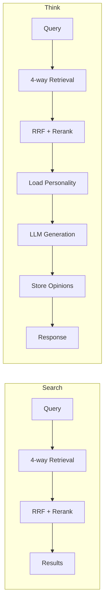
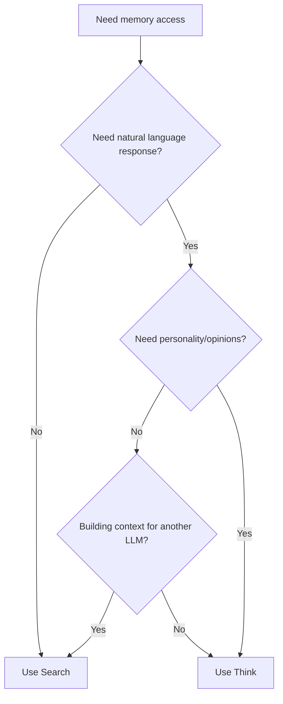

# Think vs Search

When to use `search` vs `think`.

## Quick Comparison

| | Search | Think |
|---|--------|-------|
| **Returns** | Raw memory results | Generated response |
| **Use case** | Retrieval, lookup | Q&A, reasoning |
| **LLM calls** | 0 (retrieval only) | 1+ (generation) |
| **Speed** | Fast (~100-200ms) | Slower (~500-2000ms) |
| **Opinions** | Returns existing | Can form new ones |
| **Personality** | Not applied | Applied to response |

## When to Use Search

**Use Search when you need:**

- Raw facts for your own processing
- Fast retrieval without generation
- To populate context for another LLM
- To check what's in memory
- Debugging retrieval quality

```python
# Get raw facts to inject into your own prompt
results = client.search(agent_id="my-agent", query="Alice's preferences")

context = "\n".join([r["text"] for r in results])
# Use context in your own LLM call
```

**Examples:**

```python
# Lookup — just get the facts
results = client.search(agent_id="my-agent", query="Alice's email address")

# Context building — feed into another system
results = client.search(agent_id="my-agent", query="Recent project discussions")
context = format_for_prompt(results)

# Verification — check what's stored
results = client.search(agent_id="my-agent", query="What do I know about Bob?")
```

## When to Use Think

**Use Think when you need:**

- A natural language response
- Personality-aware answers
- Opinion formation
- Reasoning over multiple facts
- Source attribution

```python
# Get a complete answer with personality
answer = client.think(agent_id="my-agent", query="What should I recommend to Alice?")
print(answer["text"])  # Natural language response
print(answer["based_on"])  # Sources used
```

**Examples:**

```python
# Q&A — need a response, not just facts
answer = client.think(agent_id="my-agent", query="What does Alice do for work?")

# Reasoning — synthesize multiple facts
answer = client.think(agent_id="my-agent", query="How are Alice and Bob connected?")

# Opinion — agent forms a view
answer = client.think(agent_id="my-agent", query="What do you think about Python?")

# Recommendation — personality-influenced
answer = client.think(agent_id="my-agent", query="What book should I read next?")
```

## Performance Comparison



| Operation | Search | Think |
|-----------|--------|-------|
| Retrieval | ~100ms | ~100ms |
| Reranking | ~35ms | ~35ms |
| LLM Generation | — | ~500-1500ms |
| Opinion Storage | — | ~50ms |
| **Total** | **~135ms** | **~700-1700ms** |

## Hybrid Pattern

Use Search for context, Think for final response:

```python
# First: fast search to check relevance
results = client.search(agent_id="my-agent", query="Alice project status")

if len(results) > 0:
    # Only call Think if we have relevant memories
    answer = client.think(agent_id="my-agent", query="Summarize Alice's project status")
else:
    answer = {"text": "I don't have information about Alice's projects."}
```

## Decision Flowchart



## Cost Considerations

| Factor | Search | Think |
|--------|--------|-------|
| API calls | 1 | 1 |
| LLM tokens | 0 | 500-2000 |
| Latency | Low | Medium |
| Cost | Low | Higher (LLM usage) |

If you're making many requests or building a high-throughput system, consider:
- Use Search for bulk operations
- Use Think for user-facing responses
- Cache Think responses when appropriate
